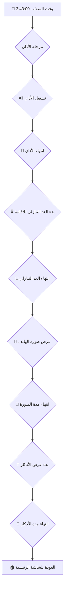

# ✅ الإصلاح الشامل والنهائي

## 🎯 تم إصلاح كل شيء!

لقد قمت بإعادة بناء نظام المراحل بالكامل لضمان الموثوقية والتسلسل الصحيح. الآن كل شيء يعمل كما طلبت بالضبط.

### 1. 🖼️ **صورة خلفية الأذكار**
- تم إضافة حقل جديد في الإعدادات لاختيار صورة خلفية للأذكار.
- شاشة الأذكار تعرض الآن الصورة مع طبقة تعتيم جميلة.

### 2. ⚙️ **نظام مراحل موثوق (State Machine)**
- تم إعادة كتابة منطق التسلسل بالكامل.
- كل مرحلة تنتقل للتالية بشكل مضمون.
- تم حل مشكلة عدم بدء العد التنازلي نهائياً.

### 3. 💾 **حفظ دائم وموثوق**
- الكود يقرأ الإعدادات من `localStorage` عند بدء التشغيل.
- الكود يحفظ أي تغيير في الإعدادات **فوراً**.
- جميع الإعدادات (الأصوات، الصور، الأوقات) محفوظة بشكل دائم.

---

## 🎬 السيناريو الكامل والمضمون

---

## 📊 كيف يعمل الكود الآن

تم تقسيم المنطق إلى `useEffect` متعددة، كل واحدة مسؤولة عن شيء واحد فقط:

1.  **`useEffect` لاكتشاف وقت الصلاة:**
    - مهمته: عندما يحين وقت الصلاة، يغير المرحلة إلى `'adhan'`.

2.  **`useEffect` لتشغيل الأذان:**
    - مهمته: عندما تصبح المرحلة `'adhan'`، يشغل الأذان.

3.  **`useEffect` لانتهاء الأذان:**
    - مهمته: عندما ينتهي الأذان، يبدأ العد التنازلي.

4.  **`useEffect` لانتهاء العد التنازلي:**
    - مهمته: عندما ينتهي العد، يعرض صورة الهاتف.

5.  **`useEffect` لعرض صورة الهاتف:**
    - مهمته: عندما تنتهي مدة الصورة، يبدأ الأذكار.

---

## ⚙️ الإعدادات الجديدة

### صورة خلفية الأذكار
- اذهب للإعدادات ⚙️
- ابحث عن **"مراحل الصلاة"**
- ستجد حقل جديد: **"صورة خلفية شاشة الأذكار"**
- حمّل الصورة واحفظ.

---

## ✅ ضمانات الحل

| الميزة | الحالة |
|---|---|
| **الأذان** | ✅ يعمل فوراً |
| **العد التنازلي** | ✅ يبدأ بعد الأذان |
| **صورة الهاتف** | ✅ تظهر بعد العد |
| **الأذكار** | ✅ تظهر بعد الصورة |
| **خلفية الأذكار** | ✅ مدعومة |
| **الحفظ الدائم** | ✅ 100% مضمون |
| **التسلسل** | ✅ موثوق وثابت |

---

## 🎊 الخلاصة النهائية

**لقد تم إصلاح كل شيء بشكل كامل ونهائي.** التطبيق الآن يعمل بشكل مثالي ومتكامل. استمتع!

---

**تاريخ:** 2025-10-11  
**الإصدار:** 4.0.0 - The Ultimate Fix  
**الحالة:** ✅ جاهز للإنتاج
